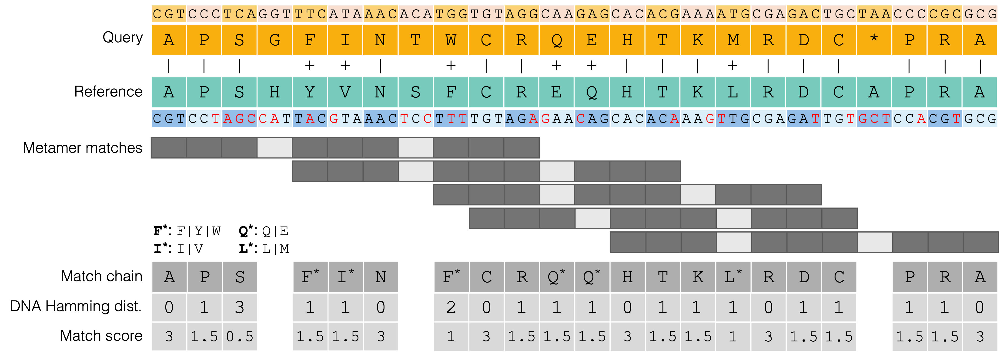

# Major Improvements 

## Metabuli v1.2.0

### Improved sensitivity via spaced k-mers and reduced amino acid alphabet
- Three layers of mismatch tolerance:
    1. Amino acid-level k-mer search allows for synonymous mutations (original feature).
    2. Reduced amino acid alphabet groups similar amino acids together, allowing for conservative substitutions (*NEW*).
    3. Spaced k-mers allow for mismatches at specific positions in the k-mer (*NEW*).

***Figure 1. Robust homology detection via spaced metamer chaining.*** Alignment of diverged query and reference sequences demonstrating the combined use of reduced amino acid alphabets and spaced seeds. Identical residues are indicated by (|). Conservative substitutions (+) are tolerated through exact matching using reduced amino acid alphabets (e.g., F* grouping F, Y, and W). The spaced metamer's joker positions enables matching across amino acid mismatches at positions 4, 8, and 21. Overlapping metamers are merged into a single match chain, which is subsequently scored based on the underlying DNA Hamming distance (mutations highlighted in red) to provide a fine-grained, nucleotide-aware match score.

### Improved scalability via syncmers 
- Syncmers are a subsampling technique that selects a subset of k-mers based on the presence of specific s-mers. This reduces the database size and classification time, minimally decreasing sensitivity in remote homology detection.
- Two times smaller database and two times faster classification when `c = (k - s + 1) / 2 = 2`.
