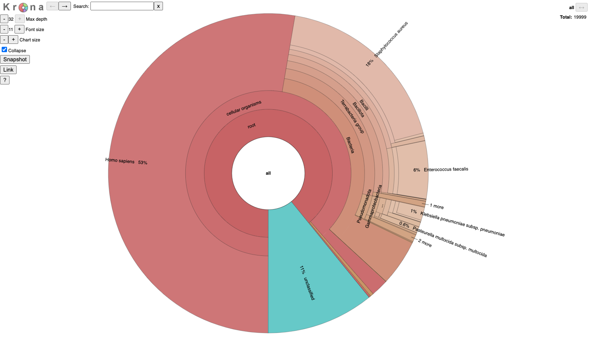

# `classify`

It classifies metagenomic reads by comparing them to a reference database.

!!! note 
    - Set `--max-ram` according to your system's available RAM.     
    - Run adapter trimming and quality filtering before classification. 
        - `fastp` for short reads and `fastplong` for long reads are integrated in **Metabuli App**

## Usage

```
metabuli classify <i:FASTA/Q> <i:DBDIR> <o:OUTDIR> <Job ID> [options]
```

| Argument | Description |
|----------|-------------|
| `FASTA/Q` | Input (gzipped) FASTA/Q file(s). Provide two files for paired-end samples. |
| `DBDIR` | Reference database directory. |
| `OUTDIR` | Directory to write output files. |
| `Job ID` | Prefix for output file names. |


## Examples

=== "Paired-end"

    ```bash
    metabuli classify read_1.fna read_2.fna DBDIR OUTDIR JOB_ID
    ```

=== "Single-end"

    ```bash
    metabuli classify --seq-mode 1 read.fna DBDIR OUTDIR JOB_ID
    ```

=== "Long-read"

    ```bash
    metabuli classify --seq-mode 3 read.fna DBDIR OUTDIR JOB_ID
    ```


## Important Options

| Option | Default | Description |
|--------|---------|-------------|
| `--precise` | `0` | Use presets for precise mode. `1`: short-read, `2`: HiFi long-read. |
| `-e` | `0 (disabled)` | Ignore matches with larger E-value |
| `--max-ram` | `128` | Maximum RAM usage in GiB |
| `--threads` | all | Number of threads to use |
| `--min-score` | `0` | Minimum score to classify a read |
| `--min-sp-score` | `0` | Minimum score to classify at or below species rank |

## Other Options
| Option | Default | Description |
|--------|---------|-------------|
| `--accession-level` | `0` | Set `1` to use accession-level classification (requires DB built with this option) |
| `--validate-input` | `0` | Set `1` to validate query file format |
| `--validate-db` | `0` | Set `1` to validate database files |
| `--lineage` | `0` | Set `1` to print full lineage next to the rank column in the classifications file |


## Output Files

`classify` produces three prefixed output files in `OUTDIR`:

| File | Description |
|------|-------------|
| `JOB_ID_classifications.tsv` | read-by-read classification results |
| `JOB_ID_report.tsv` | Summary report in Kraken2 format |
| `JOB_ID_krona.html` | Interactive Krona taxonomy chart |

!!! tip
    A Sankey diagram is also available in the [Metabuli App](https://github.com/steineggerlab/Metabuli-App) (GUI).


## Output File Formats


### 1. JOB_ID_classifications.tsv

| Column | Name | Description |
|--------|------|-------------|
| 1 | `is_classified` | `1` if classified, `0` if not |
| 2 | `name` | Read ID |
| 3 | `taxID` | Taxonomy ID in the taxonomy dump files used for database creation |
| 4 | `query_length` | Effective read length |
| 5 | `score` | DNA-level identity score |
| 6 | `e_value` | E-value of observed amino acid matches (-1: not supported) |
| 7 | `rank` | Taxonomic rank of the assigned taxon |
| 8 | `taxID:match_count` | List of `taxID:k-mer_match_count` pairs |

#### Example

```
#is_classified  name    taxID   query_length    score      e_value      rank           taxID:match_count
1               read_1  2688    294             0.627551   4.45084e-36  subspecies     2688:65
1               read_2  2688    294             0.816327   0            subspecies     2688:78
0               read_3  0       294             0          -            no rank
```

### 2. JOB_ID_report.tsv

| Column | Name | Description |
|--------|------|-------------|
| 1 | `clade_proportion` | Percentage of reads classified to the clade rooted at this taxon |
| 2 | `clade_count` | Number of reads classified to the clade rooted at this taxon |
| 3 | `taxon_count` | Number of reads classified directly to this taxon |
| 4 | `rank` | Taxonomic rank |
| 5 | `taxID` | Taxonomy ID |
| 6 | `name` | Taxonomic name |

#### Example

```
#clade_proportion  clade_count  taxon_count  rank          taxID   name
33.73              77571        77571         no rank       0       unclassified
66.27              152429       132           no rank       1       root
64.05              147319       2021          superkingdom  8034    d__Bacteria
22.22              51102        3             phylum        22784   p__Firmicutes
22.07              50752        361           class         22785   c__Bacilli
17.12              39382        57            order         123658  o__Bacillales
15.81              36359        3             family        126766  f__Bacillaceae
15.79              36312        26613         genus         126767  g__Bacillus
2.47               5677         4115          species       170517  s__Bacillus amyloliquefaciens
0.38               883          883           subspecies    170531  RS_GCF_001705195.1
0.16               360          360           subspecies    170523  RS_GCF_003868675.1
```

### 3. JOB_ID_krona.html


